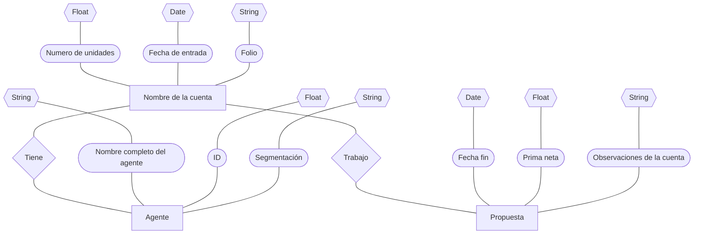

#Evidencia 2

##Se convierte la base de datos no estructurada en un modelo entidad-relación, representada con un diagrama entidad-relación.

###En el diagrama se muestra las entidades, atributos, dominio y relación 

