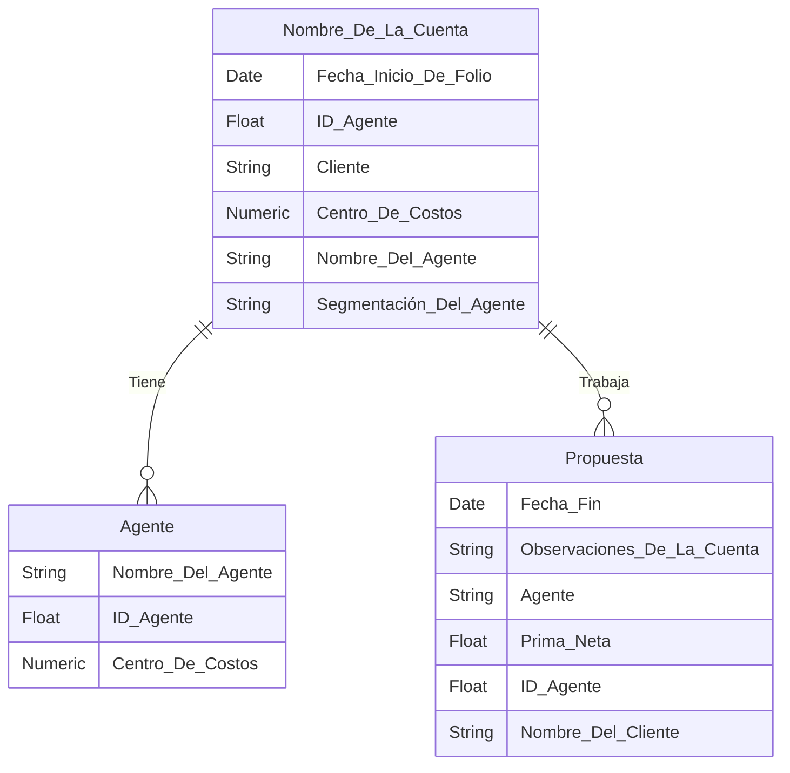

# **Evidencia 3** #
## **Esquema del modelo relación de la base de datos**

Representare la base de datos de la siguiente manera:

• **Nombre de la cuenta**
- Fecha de inicio del folio 
- Nombre del agente 
- Centro de costos 
- Segmentación del agente 
- Cliente 
- ID del agente 

• **Agente**
- ID del agente 
- Centro de costo
- Nombre del agente

 • **Propuesta**
- Prima neta
- Observaciones de la cuenta 
- Fecha fin 
- Agente 
- Id del agente 
- Nombre del cliente 

## **Diagrama Relacional**

## **Operaciones con álgebra relacional**

Se presentaran 4 operaciones álgebraicas relacionadas aplicadas a una base de datos que almacena información de cuentas de agentes de una aseguradora.

### 1.**Selección**
- **Consulta:** Obtener todas las cuentas de un agente determinado.
- **Expresión:**  σ Cuentas = 'Agente' (Agente ⨝ Nombre de la Cuentas)
- **Explicación:** Se combinan las tablas Nombre de la Cuentas y Agente por medio del ID y se regresa solamente las cuentas del agente seleccionado.

### 2.**Proyección**
- **Consulta:** Ver el nombre del agente y la prima neta de las cotizaciones que se le han realizado.
- **Expresión:** π Agente, Propuesta(Nombre de la cuenta ⨝ Agente ⨝ Propuesta)
- **Explicación:** Unimos las tablas Agente, Propuesta y Nombre del agente, se filtran las cuentas del agente seleccionad y se seleccionan solo las columnas de nombre del agente y prima neta.

### 3.**Intersección:**
- **Consulta:** Calcular el total de Prima Neta del agente.
- **Expresión:** ∩ Prima Neta, SUM(total) → total prima neta(Propuesta ⨝ Agente)
- **Explicación:** Se agrupa las primas netas del agente seleccionado y se suman en su totalidad para obtener el monto total cotizado.

### 4.**Unión Natural:**
- **Consulta:** Obtener los detalles de las propuesta (Agente,Propuesta)
- **Expresión:** Agente ⨝ Propuesta ⨝ Prima Neta 
- **Explicación:** Es la unión de las tablas para mostrar la información requerida.

